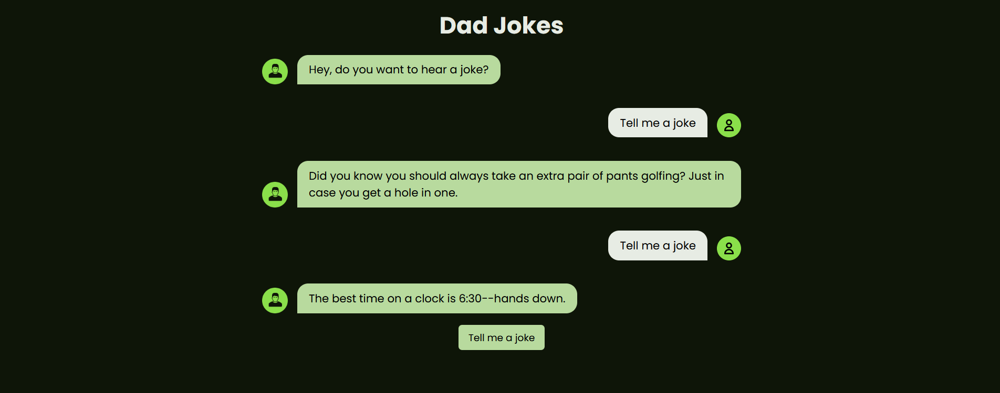

# Dad Jokes Generator

This project provides a simple implementation to fetch and display dad jokes from the [icanhazdadjoke](https://icanhazdadjoke.com/) API. It includes an HTML button to request a joke and dynamically updates the DOM to show the user's request and the received joke

## Features

- Fetches a random dad joke from the icanhazdadjoke API.
- Displays a loading indicator while fetching the joke.
- Updates the DOM to show both the user's request and the fetched joke.

## Screenshots

## Authors

- Developed and designed by: [@mdurando](https://twitter.com/ingeaeri)
